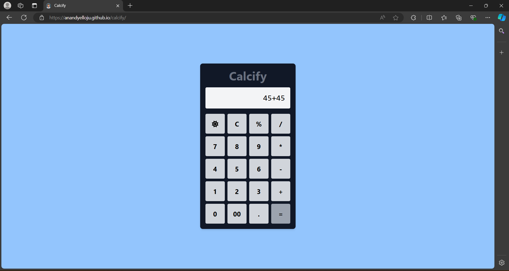

# Calcify - Calculator App

A sleek and intuitive calculator app built with React and Tailwind CSS. Perform basic arithmetic operations with a modern interface that showcases the power of React's state management and Tailwind's utility-first styling. Perfect for quick calculations and learning essential React concepts!

**Live Demo -** [Calcify](https://anandyelloju.github.io/calcify/)

## Table of Contents

- [Screenshots](#screenshots)
- [Installation](#installation)
- [Usage](#usage)
- [Features](#features)
- [Technologies Used](#technologies-used)
- [Contributing](#contributing)
- [Credits](#credits)
- [License](#license)

## Screenshots



## Installation

To set up this project locally, follow these steps:

1. Clone the repository:
    ```bash
    git clone https://github.com/anandyelloju/calcify.git
    ```
2. Navigate to the project directory:
    ```bash
    cd calcify
    ```
3. Install the dependencies:
    ```bash
    npm install
    ```
4. Start the development server:
    ```bash
    npm run dev
    ```

## Usage

After installation, you can run the project locally using the development server. The app includes the following features:

- **Basic Arithmetic Operations:** Perform addition, subtraction, multiplication, and division with ease.
- **Theme Toggle:** Switch between light and dark themes using the toggle button embedded in the calculator.
- **Responsive Design:** Optimized for both desktop and mobile devices.
- **Clean UI:** Simple and intuitive interface built with Tailwind CSS.

## Features

- **Modern Design:** Built with Tailwind CSS for a sleek, modern look.
- **Dark/Light Mode:** Easily switch between light and dark themes using the embedded toggle button.
- **Responsive:** Adapts to various screen sizes for optimal user experience.

## Technologies Used

- **React.js:** JavaScript library for building user interfaces.
- **Tailwind CSS:** Utility-first CSS framework for styling.
- **Vite:** Frontend tooling for fast development.

[](https://skillicons.dev)
<!--
## Contributing

Contributions are always welcome! If you have suggestions or improvements, feel free to submit a pull request.

## Credits

- **React.js:** For providing a robust framework for building UI.
- **Tailwind CSS:** For a flexible and customizable styling framework.
- **Vite:** For fast and efficient development tooling.
- [Anand Yelloju](https://github.com/anandyelloju) - Project Creator


## License

This project is licensed under the [MIT License](https://choosealicense.com/licenses/mit/) - see the [LICENSE](https://github.com/anandyelloju/calcify/blob/main/LICENSE) file for details.
-->
